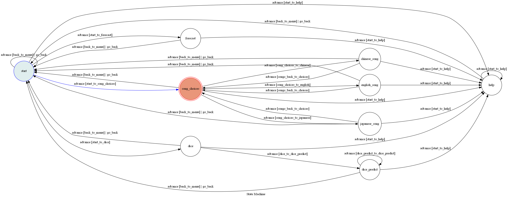

# TOC final project

## 前言
這次的作業想說先做一點基本的東西，之後因為自己有選擇困難，所以給自己用的一個類似骰子的功能，讓自己有選擇困難的時候可以用XDD
## 功能
### 起始選單
透過主畫面的選單可以使用三種功能 如圖所示 在任何一個狀態下輸入help 最終都會回到主選單

### 聽歌
可以選擇三種語言的歌曲 返回會回到主選單

如果選擇其中一種語言的歌曲 會出現下圖
點選聽歌可以點開youtube連結 進到youtube推薦歌單

### 氣象
點選天氣狀況、地震網站 
會前往天氣與最近地震的連結

### 預言
輸入任何字串都會回覆機率值 直到輸入回主選單

## fsm結構圖

